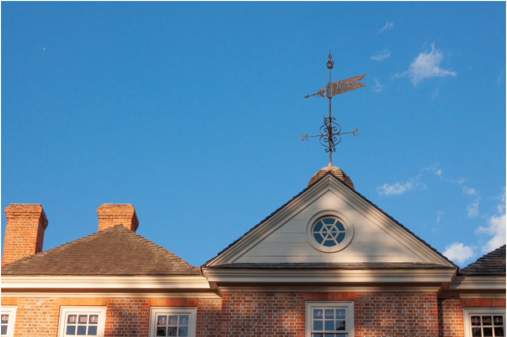

# Anna Glass' GitHub Index

Hello! My name is Anna Glass and I'm a freshman at William & Mary. I hope to double major in International Relations and Data Science. I have always loved patterns, algorithms, and data, and I am so excited to learn more about the intersection of human development and data science throughout the semester. 

I have a dog named Sofie who is very old and very small. I love hiking, kayaking, playing guitar, and painting in my free time. On campus I'm involved with the International Relations Club and the Courageous Leadership Institue. I'm looking forward to the rest of the semester! 

## Assignments
[August 25: Blumenstock Response](blumenstock.md)

[August 27: Rosling Response](rosling.md)

[September 3: Rosling and Sen Q&A](roslingqa.md)

[September 17: Human Development & Data Science Insight - Eyewire](eyewire.md)

[September 19: Assignment 1 - Housing and Human Development Indicators](assignmentone.pdf)

[September 29: Chris Anderson & Rob Kitchin Response](kitchinanderson.md)

[October 15: Human Development & Data Science Insight - Precision Medicine](precision.md)

[October 15: Owen Barder Development & Complexity Response](owenbarder.md)

[October 19: Assignment 2 - Literature Review](litreview.md)

[October 22: Assignment 3 Type of Inquiry](inquiry.md)

[November 5: Human Development & Data Science Knowledge Creation](knowledgecreation.md)
